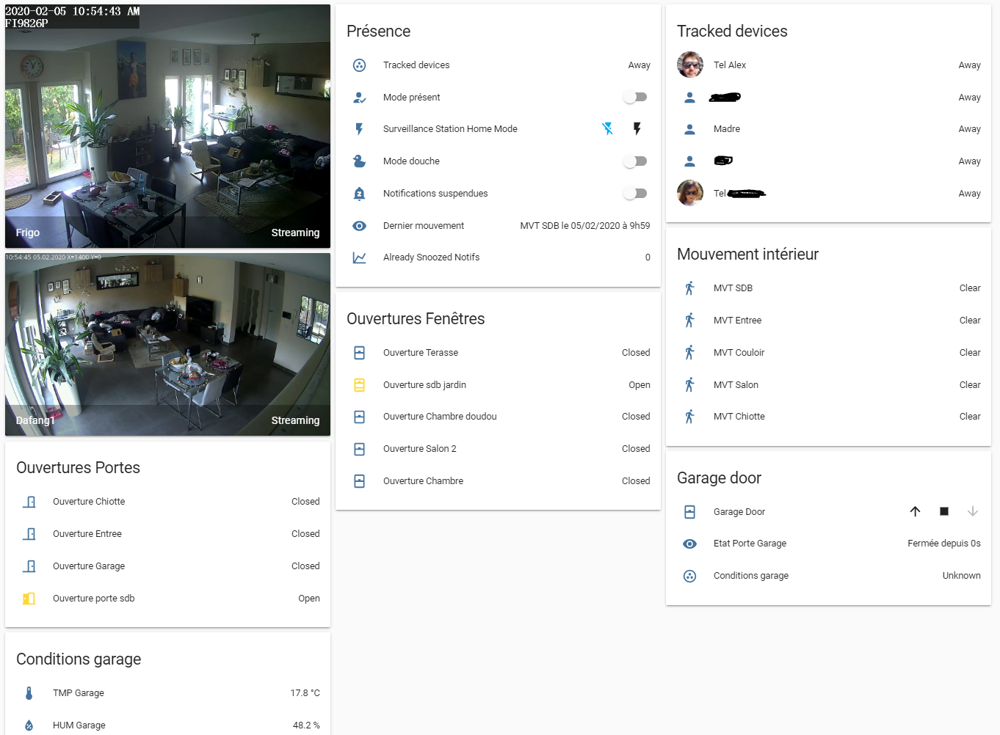

# Introduction
**AsWaM's** home assistant configuration
This is a work in progress, not a tutorial. Happy if it helps.

Using Hass.io (tried Jeedom, Hass OS, and dockered installation)

 - The full front end config can be found in the [lovelace.yaml file](lovelace.yaml).
 - The Picture Elements details [overview floorplan](lovelace-overview.yaml) and [living room interactive](lovelace-salon.yaml) are available as separate files

 - Automations: [automations.yaml](automations.yaml)
 - Scripts: [scripts.yaml](scripts.yaml)
 - Configuration: [configuration.yaml](configuration.yaml)
 - Groups: [groups.yaml](groups.yaml)
 - Sensors: [sensors.yaml](sensors.yaml)
 - Switches: [switches.yaml](switches.yaml)

 - Customizations: [customize.yaml](customize.yaml)
 - Booleans: [input_boolean.yaml](input_boolean.yaml)
 - Numbers: [input_numbers.yaml](input_numbers.yaml)
 - Dropdowns: [input_select.yaml](input_select.yaml)


## Screenshots
Below a few screenshots of how it looks like (wip)

### Interactive Overview (Picture Elements card)
Except the furniture, everything is clickable or actionable
[Live demo (YouTube)](https://www.youtube.com/watch?v=4EGnCFBxhZg)
[Yaml configuration](lovelace-overview.yaml)


### Interactive Living Room (Picture Elements card) 
All the lights and the tv are actionable
[Live demo (YouTube)](https://www.youtube.com/watch?v=QuAtu_bE5hE)
[Yaml configuration](lovelace-salon.yaml)


### Summary (mostly Entities card)


### Graphics (Sensor/History Graph card)


### Dynamic content (Monster card)


### Heating overview (Climate/Entities card)


### Sensors (Entities Cards)


### Surveillance (Picture Entity/Entities Card)


### Batteries (Monster/Entities Card)


# Expected improvements
- Add motors to the Rolle Shutters and integrate them
- <del>Add a Tado smart TRV in the bathroom</del> --> Done


# Used integrations & Hardware
## Heating / Climate
- Tado smart TRVs (x5) + Tado Gateway
## Custom Sensors
- Template (for sensor batteries, average temperature, turned on lights etc...) 
- History (Already cleaned today, Sonnzed notification, ect) 
## Calendar
- Google Calendar
## Notification
- Telegram
## Cameras integration
- Synology, custom python script to trigger home/away mode
## Cameras Models
- Foscam FI9821P
- Xiaomi dafang with [EliasKotlyar Xiaomi-Dafang-Hacks custom Firmware](https://github.com/EliasKotlyar/Xiaomi-Dafang-Hacks)
- Eufy Security cam V2 (not integrated yet) 
## Presence Detection
- bluetooth device tracker
- <del>Tado GeoFence</del> Desactivated that, prevents you to remotely turn the heating on
- Could not get the NUT ble tracker to work (ble_device_tracker)
## Sensors
- Xiaomi Gateway V2
- Xiaomi Temperature and Humidity Sensor (x9) both v1 and v2
- Xiaomi Window/Door Sensor (x6) both v1 and v2
- Xiaomi Motion Sensor (x5) both v1 and v2
- Xiaomi Bed Activity Sensor (currently unused)
## Actionners
- Xiaomi Smart Button (x3) both v1 and v2
- Xiaomi Magic Cube (x2)
- Xiaomi Smart Plug (x3)
- Sonoff T2 EU 1CH (x4) with [arendst Tasmota Custom Firmware](https://github.com/arendst/Tasmota)
- Sonoff T2 EU 2CH (x3) with [arendst Tasmota Custom Firmware](https://github.com/arendst/Tasmota)
## Media Player
- LG TV
## Plants
- Mi flora (x2)
## Meteo
- YR.no
- DarkSky
## Lights
- Yeelight RGB Bulb (x6) both v1 and v2
- YeeLight RGB Led Strip (x3) both v1 and v2
- Yeelight BedSide Lamp (v2)
- Xiaomi Philips BedSide Lamp
## Infrared / Radio Frequency
- Broadlink RM Plus
## Vaccuum cleaner
- Roborock S50 Vacuum cleaner
## Garage
- Garadget
## Hass.IO Extensions
- Google cloud backup
- Tasmota Admin
- Mosquito Broker
## Hardware
- FritzBox 6190 Cable
- Xiaomi Mi Router 3G with [OpenWRT LuCi](https://openwrt.org/docs/guide-user/luci/start)
- Synology NAS DS218+
- Raspberry Pi 4B

# Groups
Originally, (pre-lovelace) this was used for both display and use of multiple sensors/automations/lights etc together.
Now, with lovelace, the display is useless, but still here for automations, sums, etc

All this can be found in the dedicated file [groups.yaml](groups.yaml)

## Device tracker

The magic about that, is that the group is 'home' if any of the trackers is 'home' and is 'not_home' if nobody is in the house. So the group is actually 'anyone home?' it switches to 'home' when the first person comes, and switches to 'not_home' when the last departs, which is just perfect for automations

```
  tracked_devices:
    name: Tracked devices
    entities:
       - device_tracker.qcombtd
       - device_tracker.samsungsmg920f
       - device_tracker.galaxy_s8
       - device_tracker.lia
```

## Sensors
The magic about that, is that if any goes from 'off' to 'on' the the whole group goes from 'off' to 'on', so you can trigger an automation if any of them is triggered, and if you add a new one, just add it to the group and it is intergrated to automations automatically

The list here is not exhaustive, have a look a the groups.yaml file

Motion sensors inside the house 
```
  motion_sensors:
    name: Mouvement intérieur
    entities:
       - binary_sensor.motion_sensor_158d0001e47f52
       - binary_sensor.motion_sensor_158d0001e47d34
       - binary_sensor.motion_sensor_158d0001ddca38
       - binary_sensor.motion_sensor_158d0001b7542d
       - binary_sensor.motion_sensor_158d0001d6675f
```
Open closed sensor on doors
```
  door_sensors:
    name: Ouvertures Portes
    entities:
       - binary_sensor.door_window_sensor_158d0001ab1b67
       - binary_sensor.door_window_sensor_158d0001ab5aaa
       - binary_sensor.door_window_sensor_158d0001d8526a
       - binary_sensor.door_window_sensor_158d000272f13c
```

These groups help for the averages
```
  room_humidity:
    name: Humidité Maison
    entities:
       - sensor.humidity_158d0001b96127
       - sensor.humidity_158d0001b92bcc
       - sensor.humidity_158d0001b8f1b1
       - sensor.humidity_158d00022734f8
  room_temperature:
    name: Température Maison
    entities:
       - sensor.temperature_158d0001b96127
       - sensor.temperature_158d0001b92bcc
       - sensor.temperature_158d0001b8f1b1
       - sensor.temperature_158d00022734f8
```
## Lights

These groups allow to control several lights simultaneously
```

  light_salon:
    name: Salon
    entities:
       - light.yeelight_color1_34ce008fcea8
       - light.yeelight_color1_34ce00900013
       - light.yeelight_color1_7811dc6aaca4
       - light.yeelight_strip1_7811dca22953
```

## Groups

And of course groups of groups
```
  all_open_sensors:
    name: Tous capteurs ouverture
    entities:
       - group.door_sensors
       - group.window_sensors
```


## Automations

Allows to deactivate the automations not "supported" by the wife when she is at home, and reactivate them the rest of the time

```
  non_waf:
    name: Non WAF scenarios
    entities:
       - automation.allumage_sdb_auto
       - automation.extinction_sdb_auto
       - automation.allumage_couloir_auto
       - automation.extinction_couloir_auto
       - automation.changement_lumieres_a_6h_et_20
       - automation.changement_lumieres_a_7h_et_19h
       - automation.changement_lumieres_a_9h_et_17h
       - automation.changement_lumieres_a_22h
       - automation.changement_lumieres_a_23
```


# Automations

All the automations can be found in the dedicated file [automations.yaml](automations.yaml)

## Buttons

## Automatic

## Telegram

## Magic Cube

## Calendar based

## Time based

# Scripts

All the scripts can be found in the dedicated file [scripts.yaml](scripts.yaml)
## Heating

The tado application allows to set daily patterns for the heating, but if you use their geofencing mode, you cannot override the presence (you cannot start the heating in adavance for example). So the turn on heating is actually switching all the valves in auto mode (with a 3s delay not to stress the server) and the turn off sets them to manual on a low tempreature.

```
  heating_on:
    alias: Passe chauffage en mode Home
    sequence:
      - service: climate.set_hvac_mode
        data: 
          entity_id: climate.salon
          hvac_mode: auto
      - delay:
          seconds: 3
      - service: climate.set_hvac_mode
        data: 
          entity_id: climate.cuisine
          hvac_mode: auto
      - delay:
          seconds: 3
      - service: climate.set_hvac_mode
        data: 
          entity_id: climate.chambre_alex
          hvac_mode: auto
```


# Custom Sensors

All this can be found in the dedicated file [sensors.yaml](sensors.yaml)

## History

These ones are used to know historical things (did the vacuum cleaner work today, did we snooze notifcations already...)
```
- platform: history_stats
  name: Cleaned Today
  entity_id: vacuum.xiaomi_vacuum_cleaner
  state: 'cleaning'
  type: time
  start: '{{ now().replace(hour=0).replace(minute=0).replace(second=0) }}'
  end: '{{ now() }}'
- platform: history_stats
  name: Already Snoozed Notifs
  entity_id: input_boolean.snooze_notifs
  state: 'on'
  type: count
  start: '{{ now().replace(hour=0).replace(minute=0).replace(second=0) }}'
  end: '{{ now() }}'
```
## MQTT
```
- platform: mqtt
  name: Garage Door Status
  state_topic: "garadget/Garage/status"
  value_template: '{{ value_json.status }}'
```

## Template

These ones are used to calculate things (battery level of a sensor with a custom icon, averages, last mouvement, opened windows, etc...)

### Battery level

N.B: Could maybe done recursively, atm i do the same calcultaion for all sensors

```
- platform: template
  sensors:
    bat_mvt_sdb:
      friendly_name: Mouvement SDB
      value_template: >
        
          110
        
          {{ states.binary_sensor.motion_sensor_158d0001e47f52.attributes["battery_level"] | float}}
        
      icon_template: >
        
        
        
          mdi:battery
        
          mdi:battery-{{ battery_round_xod1 }}
        
          mdi:battery-charging-wireless-outline
        
      unit_of_measurement: '%'
```
### Last activated movement sensor

Gives back a text with the friendly name of the sensor and its last activation
N.B: There is a little (acceptable) bug: The last changed can be change back to 'not-detected' state 1 min after last actual movement

```
- platform: template
  sensors:
    last_motion:
      friendly_name: Dernier mouvement
      value_template: >
        
        
        {{allmotion |selectattr('last_changed','eq', open)|map(attribute='name')|list|join}} le {{ as_timestamp(open) | timestamp_custom('%d/%m/%Y à %-Hh%M') }}
```

### Summaries

Gives back a comma separated list of friendly names of sensors with a given state (turned on lights, opened windows, visible trackers etc)

The second line  forces the reread of the sensors value every minute, or the template sensor is never re-evaluated... Took me ages to figure that out
```
{% set forceupdate= strptime(states.sensor.date_time.state, '%Y-%m-%d, %H:%M')%}
```

Uses groups for dynamic integrations

```
- platform: template
  sensors:
### Fenetres ouvertes
    opened_windows:
      friendly_name:  Fenetres ouvertes
      value_template: >
        
        {% set forceupdate= strptime(states.sensor.date_time.state, '%Y-%m-%d, %H:%M')%}
        
        {{ open| length}} / {{ allwindows | length}} ({{open | map(attribute='name') |list | join(', ') }})
### Lumières allumées
    active_lights:
      friendly_name:  Lumières allumées
      value_template: >
        
        {% set forceupdate= strptime(states.sensor.date_time.state, '%Y-%m-%d, %H:%M')%}
        
        {{ turnedon| length}} / {{ alllights | length}} ({{turnedon | map(attribute='name') |list | join(', ') }})
### trackers visibles
    home_trackers:
      friendly_name:  Trackers visibles
      value_template: >
        
        {% set forceupdate= strptime(states.sensor.date_time.state, '%Y-%m-%d, %H:%M')%}
        
        {{ present| length}} / {{ alltrackers| length}} ({{present | map(attribute='name') |list | join(', ') }})('%d/%m/%Y à %-Hh%M') }}
```
### Averages

Gives back the value of the average of a group of sensors
The second line forces the reread every minute of the sensors value, or the average is never recalculated... Took me ages to figure that out
```
{% set forceupdate= strptime(states.sensor.date_time.state, '%Y-%m-%d, %H:%M')%}
```


Forcing the unit allows to put them on the same graph as the actual sensors
Uses groups for dynamic integrations


N.B: There is a little (not very acceptable) bug: if a sensor is unavailable, it will count as 0 and trick the average. Could be excluded in the first selection


```
- platform: template
  sensors:
    average_temperature:
      friendly_name: Températe moyenne
      unit_of_measurement: '°C'
      value_template: >
           
           {% set forceupdate= strptime(states.sensor.date_time.state, '%Y-%m-%d, %H:%M')%}
           
           {{ (values |sum / values |length)|round(2) }}
    average_humidity:
      friendly_name: Humidité moyenne
      unit_of_measurement: '%'
      value_template: >
           
           {% set forceupdate= strptime(states.sensor.date_time.state, '%Y-%m-%d, %H:%M')%}
           
           {{ (values |sum / values |length)|round(2) }}
```

# How it works
## lovelace dynamic
It was based on the monster card. You can find it on [ciotlosm Github](https://github.com/ciotlosm/custom-lovelace/tree/master/monster-card). Copy it to your /js folder

Edit: Migrated to Auto entities. You can find it on [thomasloven Github](https://github.com/thomasloven/lovelace-auto-entities). Copy it to your /js folder


Add code at the beigining of the lovelace file
```
resources:
  - type: js
   url: /local/js/auto-entities.js?v=1.1
```
You for example can the get all the turned on lights with the following code
```
      - card:
          title: Lumières Allumées
          type: entities
        filter:
          include:
            - entity_id: light.*
              state: 'on'
        type: 'custom:auto-entities'
```
Or the present device trackers
```
      - card:
          title: Personnes présentes
          type: glance
        filter:
          include:
            - entity_id: device_tracker.*
              state: home
        type: 'custom:auto-entities'
```
Or all the low batteries
```
      - card:
          title: Batteries inférieures a 33%
          type: glance
        filter:
          include:
            - entity_id: sensor.bat*
              state: < 30
        type: 'custom:auto-entities'
```
Last example with exclusions, all the turned on switches except the ones created by the dafang cam
```
     - card:
          title: Interrupteurs Allumées
          type: entities
        filter:
          exclude:
            - entity_id: switch.dafang*
          include:
            - entity_id: switch.*
              state: 'on'
        type: 'custom:auto-entities'
```
## Picture elements
You need a background image, and if you like a different one for the switched (on or off) then another one.
I used [Paint.Net](https://www.getpaint.net/download.html) to darken/lighten the images
then you just need to switch the image according to the status of a sensor (here a switch). You could also do the same with css transforms on the image.
```
          - entity: switch.chambre
            image: /local/images/chambre.png
            state_image:
              'off': /local/images/chambre_off.png
              'on': /local/images/chambre.png
            style:
              left: 30%
              top: 64.5%
              width: 24.5%
            tap_action:
              action: none
            type: image
 ```
You can also add a tap action on the image
 ```
- entity: input_boolean.mode_waf
            state_image:
              'off': /local/images/waf_off.png
              'on': /local/images/waf.png
            style:
              left: 6%
              top: 28%
              width: 9%
            tap_action:
              action: toggle
            title: mode waf
            type: image
 ```
## Customizations
They are mostly used to force the icon in the lovelace ui and/or in the picture elements cards, and to give them a friendlier name
All this can be found in the dedicated file [customize.yaml](customize.yaml)

```
climate.salon:
  icon: mdi:radiator
light.yeelight_strip2_04cf8c7acfe8:
  friendly_name: LightStrip Doudou
  icon: mdi:led-off
```
